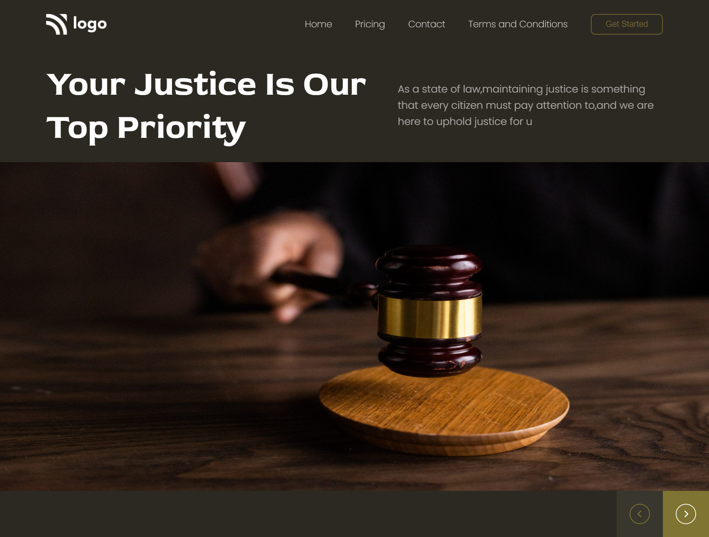

## PROJECT NAME: Law Home Page

### **💻TECH STACK USED IN THIS PROJECT:** 
- 
- 

### **🛠WHAT I HAVE LEARNT IN THIS PROJECT:** 
- Adjusting an image to the screen
- Setting the line-height
- designing Buttons 
- CSS Flex-box
- Paddings and Margins
- hover effect
- CSS Selectors

### **⌛TIME TAKEN TO COMPLETE THIS PROJECT:** 
- I have taken 2 hours to complete this project.

### **👀HOW MY PROJECT LOOKS LIKE:**

### 💻It works only in **LAPTOP**(Not Responsive).

### **🚀LIVE LINK:**
-  This project is hosted on **Netlify**.You can Check it live using below link: 
-  [Project Live Link !](https://631b51f476d38509be15c482--gentle-pithivier-13f4d3.netlify.app/)

